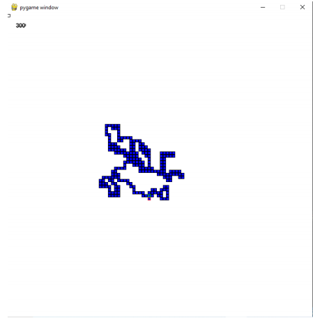
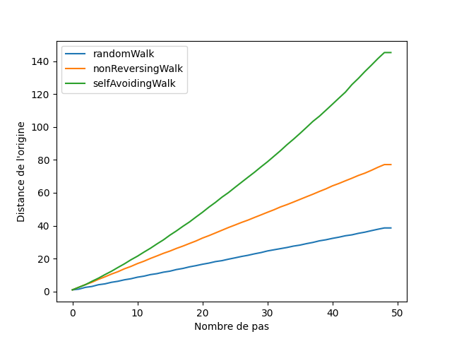
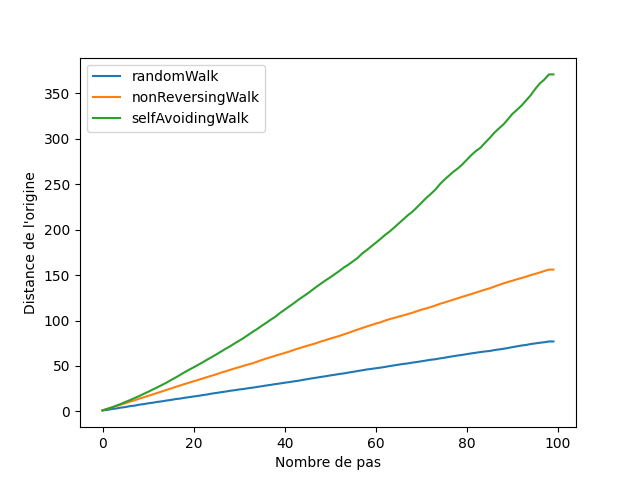

# RandomWalkSimulator
A program which simulates a person who randomly walk in her environment

Notes : Ce programme a été fait pour un projet scolaire. Le code pourrait être largement amélioré mais par manque de temps, je n'ai pas pu le réécrire afin qu'il soit sous forme de module et qu'il soit fonctionnel.
Ce readme est le rapport final rendu, il explique comment ont été faites les différentes parties et analyse les résultats du programme.

## Partie 1 – création d’un générateur
Le générateur a été développé en python et est de type récurrence linéaire à deux termes. Il utilise les librairies random.py et datetime.py. Le générateur ressemble fortement à celui vu en cours (générateur MRG32k3a).

Pour générer une suite de nombre il faut appeler la fonction generateSequence et passer en paramètre le nombre minimum à générer, le nombre maximum à générer et la taille de la suite que nous voulons générer.

Le générateur va tout d’abord générer une seed en fonction de l’heure et de la date actuelle de l’OS. Avec cette graine, il va générer 6 nombres pseudo-aléatoires (x0, x1, x2, y0, y1 et y2). Il vérifie ensuite que x0, x1 et x2 ne soit pas tous égaux à 0 ou que y0, y1 et y2 ne soit pas tous égaux à 0.

Une suite de xn et de yn va ensuite être calculé grâce aux calculs suivants :
```bash
xn = (1403580 * xn−2 − 810728xn−3) % 4294967087
yn = (527612 * yn−1 − 1370589yn−3) % 4294944443
```
A chaque nouveau xn et yn généré, un nombre va être calculé comme ci-dessous et est ajouté à une suite de nombre un :
```bash
un = [(xn − yn) % (max-min+1) +min].
```
Cette suite un est notre suite de nombre pseudo-aléatoire générée.
Le générateur peut également générer des nombres négatifs.

## Partie 2 – Test du générateur
Pour tester le générateur, j’ai utilisé la librairie scipy.stats. Vous pouvez installer Scipy ici : https://www.scipy.org/install.html

Après avoir lancé deux dés 1000 fois en calculant la somme à chaque fois, j’ai regroupé le nombre de fois qu’apparaissait chaque valeur. J’ai donc calculé les probabilités obtenues pour chaque valeur et j’ai utilisé le test de khi2 afin de comparer les probabilités observées et les probabilités connues.

J’ai utilisé la fonction chisquare de la libraire scipy.stats de cette façon :
```python
chisquare(probs, f_exp=[1/12,1/12,1/9,5/36,1/6,5/36,1/9,1/12,1/12])
```
Ici probs est le tableau des probabilités observées et f_exp correspond aux probabilités connues.
```bash
Power_divergenceResult(statistic=0.009664399999999995, pvalue=0.9999999999773698)
```
On peut voir que la valeur de pvalue est très proche de 1. Ce qui signifie que les probabilités observées et les probabilités connues sont très similaires. Elles suivent bien une loi normale, et cela signifie que le générateur de nombre pseudo-aléatoire fonctionne correctement.

Pour la variable statistic obtenue, plus elle est faible, plus l’occurrence observée est proche de l’occurrence attendue, ce qui revient à dire la même chose que pour la pvalue : le générateur fonctionne correctement.

## Partie 3 – Utilisation du générateur
La simulation commence par initialiser l’environnement 2D. Cet environnement est réalisé avec la librairie Pygame. Dans le simulateur, l’environnement est représenté par un tableau à deux dimensions, mais Pygame va nous permettre de dessiner la marche au fur et à mesure de son avancée.

Puis le programme demande à l’utilisateur quel marche il faut simuler ainsi que le nombre de pas voulu. Il va ensuite générer une suite de nombres entre 1 et 4 avant de commencer la marche. Il y a 4 modes de marche possibles :

1 – Random walk

2 – Non reversing walk

3 – Self-avoiding walk

4 – Toutes les marches + graphique

Notes : lorsque le programme est lancé, le tableau représentant l’environnement est rempli par des 0. La position initiale est placée au milieu de ce tableau. Les coordonnées sur lesquelles la marche se déplace prennent la valeur 1.

Le random walk va, pour chaque pas, récupérer la valeur générée et déplacer les coordonnées actuelles dans l’environnement dans une des 4 directions possibles. La nouvelle coordonnée deviendra alors un 1. Suite à ça on dessine un nouveau rectangle correspondant aux coordonnées dans notre fenêtre Pigame.

Le non reversing walk va faire la même chose que le random walk mais pour chaque pas, il va remplacer la valeur du tableau des coordonnées d’où il vient par un 2. Lorsqu’il va se déplacer, il vérifie que les prochaines coordonnées ne contiennent pas la valeur 2. Si c’est le cas, on passe au pas suivant. Si le déplacement est fait, la coordonnée ayant la valeur 2 reprend la valeur 1.

Les pas qui n’ont pas été réalisés sont regénérés via le générateur de nombre et la fonction de non reversing walk est de nouveau appelée. On fait cette étape jusqu’à ce que le nombre de pas désiré soit atteint.

A chaque pas réalisé, le programme dessine un nouveau rectangle correspondant aux 
coordonnées dans notre fenêtre Pigame.

Le self-avoiding walk va faire la même chose que le random walk mais pour chaque pas, il va vérifier que les prochaines coordonnées ne contiennent pas la valeur 1. Ce qui signifie qu’il ne repassera jamais sur un point qu’il a déjà visité.

Les pas qui n’ont pas été réalisés sont regénérés via le générateur de nombre et la fonction de self-avoiding walk est de nouveau appelée. On fait cette étape jusqu’à ce que le nombre de pas désiré soit atteint où jusqu’à ce que la marche se retrouve bloquée entre 4 points déjà visités.

A chaque pas réalisé, le programme dessine un nouveau rectangle correspondant aux coordonnées dans notre fenêtre Pigame.

Il arrive que lors de ce mode, la marche se retrouve entourée par des valeurs 1 et ne puisse plus avancer. La simulation s’arrête alors. Cela peut arriver à tout moment, que ce soit au pas 15 comme au pas 300.

Le 4eme mode va réaliser 10 000 fois les 3 marches différentes à la suite en utilisant des suites de nombres générés aléatoirement différentes. Un graphique est dessiné à la fin en utilisant la moyenne des distances entre les points à chaque pas et le point d’origine. La marche SelfAvoiding pouvant s’arrêter plus tôt si elle se retrouve bloquée, le fait de réaliser un grand nombre de fois l’expérience permet d’avoir une courbe de distance moyenne plutôt fiable pour un nombre de pas faible.

Le rendering 2D de l’environnement se présente comme ceci :


Nous pouvons apercevoir la marche en bleu, la position actuelle entourée en rouge, et le nombre de pas effectué est affiché en haut à gauche de l’écran.
En utilisant le mode 4, nous pouvons obtenir des courbes ressemblant à celles-ci :


Ici, les courbes ressemblent à celles de l’article « How to avoid yourself » écrit par « Brian Hayes ». La valeur des distances n’est pas la même mais leurs formes et la proportionnalités entre les valeurs correspondent.

Voici une autre figure en essayant avec 100 pas :


Note : Le code peut paraître un peu « brouillon » en étant écrit dans un seul fichier python pour la partie 3. Je m’en excuse, je n’ai pas trouvé le temps de réécrire le code correctement en le séparant en différents modules tout en le gardant fonctionnel.
